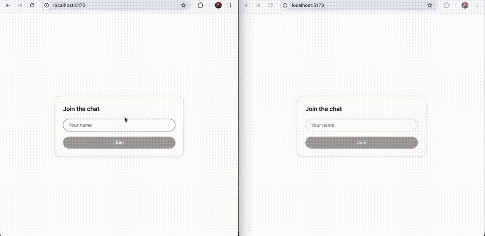

# Realtime Chat App

## About

A simple real-time chat application built with React, Express, and WebSocket — written entirely in TypeScript. Two users can join with a username and exchange messages instantly, with live join/leave notifications and connection status.

**Features:**
- Real-time messaging over a persistent WebSocket connection
- Live typing indicators ("Alice is typing…")
- Online user count
- Automatic handling of duplicate usernames
- Join/leave system notifications
- Message timestamps and character limit with live counter
- Connection status indicator 

## Demo



## Stack
- **Frontend:** React + Vite + TypeScript + Tailwind CSS
- **Backend:** Express + `ws` + TypeScript (ESM)

## Getting Started

### 1. Backend
```bash
cd server
npm install
npm run dev
```
Runs on the port set in `server/.env` (defaults if unset).

### 2. Frontend
```bash
cd client
npm install
npm run dev
```
Runs at `http://localhost:5173`.

Open two browser tabs, join with two different names, and start chatting.

## Notes
- Messages are held in memory only — no persistence across server restarts.
- No authentication — usernames are self-declared on join.